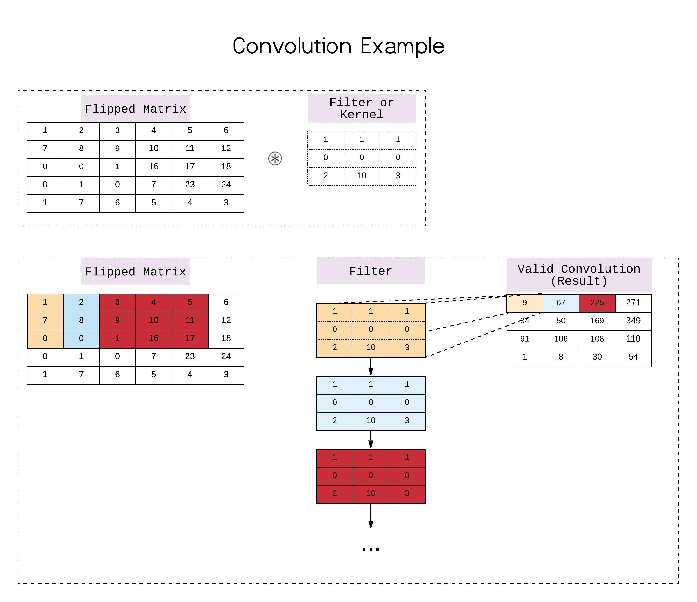
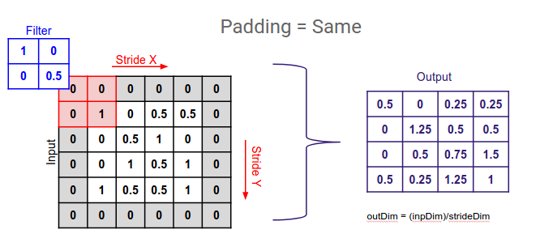

# Sesiones

## Martes

### Introducción
* Intención
* Modo de trabajo 
* Evaluación y entregables
* [Intro a control de versiones](Files/Git.pptx)

### Computer Science Tools: Creación Repo Individual 

Sigue el siguiente tutorial de github, [Creación de cuenta y submits Github](Files/Laboratorio%20GitHub.pdf)
al terminar deberás tener creada tu cuenta y tu repositorio individual, recuerda hacer tus commits siguiendo estándares ya que estos se usarán para calificar la semana tec.

### Computer Science Tools: Trabajando en equipo: Ramas y Merges
Sigue el siguiente tutorial de github, [Laboratorio Ramas](Files/Laboratorio%20Ramas.pdf)
al terminar deberás tener un repositorio en equipo  en el cuál trabajaras con tus compañeros, recuerda que se evaluán los commits indivudales de cada quién, así es necesario que cada quien haga commits desde su propia cuenta al repositorio en equipo y que hagan los merges pertinentes.

## Miércoles

### Explicación del estándar usado para evaluar (Clase 30 min)
[Guías de estilo para python.  (PEP 8)](https://www.python.org/dev/peps/pep-0008/)

[Guías de estilo para github   (Templates de los Commits en el proyecto).](https://medium.com/@nawarpianist/git-commit-best-practices-dab8d722de99)
Explicación de entrevista.

estándares para logs en repositorios:

[Git best practices 1](https://medium.com/@nawarpianist/git-commit-best-practices-dab8d722de99)

[Git best practices 2](https://deepsource.io/blog/git-best-practices/)

### ¿Qué es y para qué sirve el procesamiento de imágenes? (Clase 30 min)
* La visión computacional y el procesamiento de imágenes.
* Las imágenes son matrices de números

[source](https://becominghuman.ai/real-computer-vision-for-mobile-and-embedded-part-1-c04ea8b9fd26).
* Mostrar ejemplos de detectores. 

 
[source](https://docs.opencv.org/master/d5/d0f/tutorial_py_gradients.html)
* Lo que se espera al final de la semana: Proyecto Vision/sobel.py (requiere: pip install opencv-python) 
* Mostrar redes Convolutivas 
 

[source](https://becominghuman.ai/real-computer-vision-for-mobile-and-embedded-part-1-c04ea8b9fd26).

## Miércoles

### ¿Que es una convolución?  (Clase 30 min)

y en una imagen real de 3 dimensiones:
[Conv animation by Andrej Karpathy](https://pathmind.com/wiki/convolutional-network) 

### Ejercicio acompañado convolución a mano  (Clase 30 min)
Hagamos una convolución a mano para entender mejor como funciona.
[Ejemplo de convolución](Files/examples%20convolution.xlsx)

### Explicación y Demo de Implementación de Convolución  (Clase 30 min)
Una convolución simplificada, poco eficiente, pero más entendible a continuación veremos el código paso a paso, descarlo y agrega comentarios.
[Convolution Simple.py](Scripts/Ejemplos/simple_conv.py)

### Implementación de convolución individual (Trabajo independiente 60 min)
Basándote en el ejemplo mostrado en clase, implementa tu propia versión de una convolución. Tu función debe recibir 2 matrices: la imagen a modificar y el filtro, y debe devolver la matriz resultante de la operación.
Cuando tu programa esté funcionando, súbelo a tu repositorio de git (commit y push) y pega el link de tu repo en canvas en la actividad de implementación de convolución individual. Recuerda que tu código y commits deben de cumplir con todos lo estándares.   

### Búsqueda de Filtros (Innovación): (Trabajo independiente 40 min)
La primera parte de un innovación radica en conocer qué es lo que se hace actualmente. Lo primero que debes hacer es investigar y encontrar que diferentes filtros usados para concoluciones y sus efectos en las imágenes. Buscar un par y comparalos con tu equipo e identifiquen cuál es el estándar que mejor complementa su proyecto. Incluye en el readme del proyecto los estándartes que buscaron, las fuentes de donde los sacaron y la esplicación de cual fue el que escogieron para implementar cada uno y porqué.
Aquí puedes comenzar tu búsqueda:
[Kernel for Convolutions](https://aishack.in/tutorials/image-convolution-examples/)

### Propuesta de Proyecto (Innovación): (Trabajo independiente 20 min)
En equipo generen un repositorio para su proyecto, recuerden que cada quien tendrá que hacer su propia rama y después integrarlo con su repositorio prinicpal.
Siguiendo las buenas prácticas de github y python preparen el esqueleto de lo que será su proyecto y hagan la repartición del trabajo que le tocará a cada uno. Se espera que cada miembro del equipo generé sus porpios commits desde su cuenta personal y que integren el proyecto (merge branch) en un solo repositorio usando Git. Si no se tienen commits individuales y el merge, no tendrán evindencia suficiente para acreditar la semana. El objetivo es que no pierdan tiempo en el setup del proyecto en las siguientes sesiones.

### Setup de las herramientas y uso de opencv (Clase 60 min)
Explicación de código muestra para leer y generar imágenes, instalación de opencv con PIP (60 min)
1. Mostrar cómo instalar Opencv en python                          (pip install opencv-python)
2. Mostrar cómo se reciben los archivos corriendo el programa      (python sobel.py  --image imagen.jpg) 
3. Mostrar cómo se reciben los archivos dentro del cósigo          (args = vars(ap.parse_args()) 
4. Mostrar como se transforman las imágenes en números             (image = cv2.imread(args["image"])

## Jueves

### ¿Qué es el Padding? (Clase 15 min)

Imagen de deeep learning using Caffe by Claud Greer

### Padding a mano acompañado (Clase 15 min)
Archivo excel ejemplo padding

### Explicación y Demo de Implementación de Padding (Clase 30 min)
[Convolución con padding](Scripts/Ejemplos/convolution.py)

### Implementación de Padding estudiantes individual acompañado por profesor  (Clase 60 min)
Basándote en el ejemplo mostrado en clase, implementa tu propia versión de una convolución. Tu función debe recibir la matriz y el tamaño que debe tener la matriz a rellenar, y debe devolver la matriz llena de ceros en la orilla.
Cuando tu programa esté funcionando, súbelo a tu repositorio de git y entrega pega el link de tu repo en canvas en la actividad de implementación de convolución individual. Recuerda que tu código y commits deben de cumplir con todos lo estándares.

### Mostrar Ejemplo de repositorio con buenas prácticas

## Viernes
### Entrevista
Durante a la última sesión el profesor se sentará con cada equipo para ver el avance que llevan y saber que hizo cada estudiante, estas notas las usará como parte de la evaluación para determinar que cada estudiante este hacieno su parte correspondiente. 

**Se espera que para esta sesión el repositorio en equipo ya tenga un avance del 80% de todos los miembros del equipo y que el programa ya esté funcionando.**

### Entrega en canvas tus repositorios y video
Evidencia de proyecto
Evidencia de competencias en lumen
